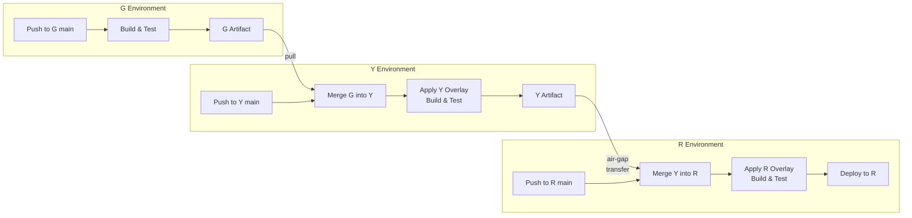
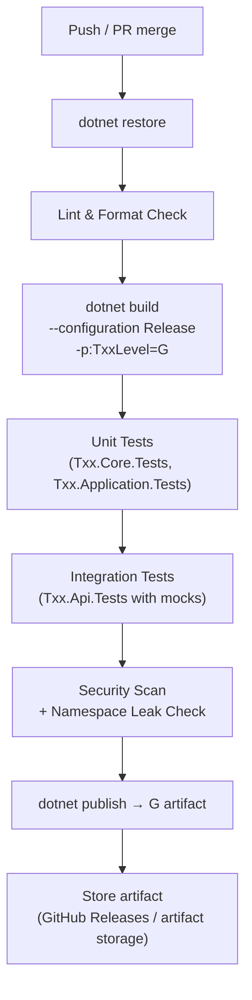
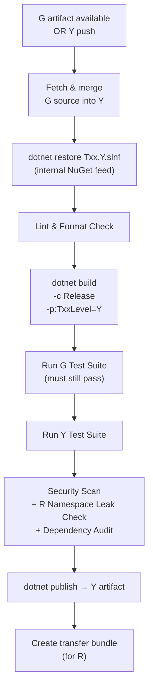
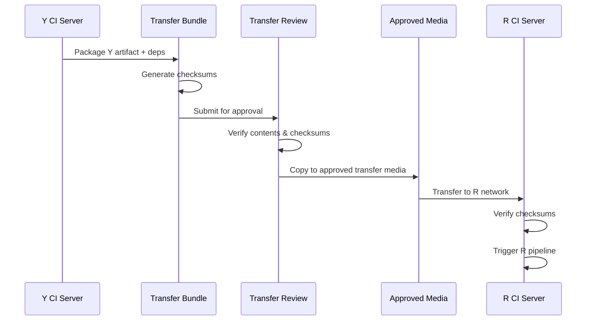
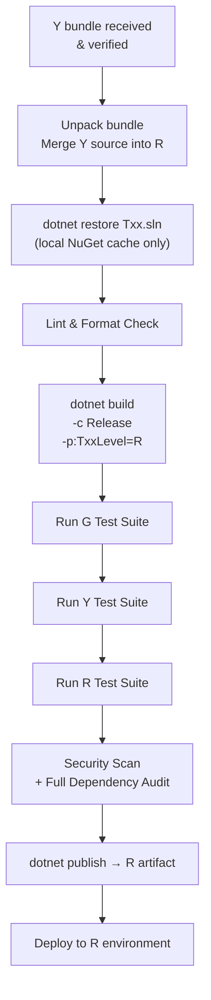

# CI/CD Pipeline: G → Y → R

## Overview

The TXX system has a continuous integration chain that flows through all three restriction levels. Each level has its own pipeline. The output of one level feeds into the next.



## G Pipeline

**Trigger:** Push to `main` or `develop` on G repo (GitHub)



### G Pipeline Steps

| Step | Command | Purpose |
|------|---------|---------|
| Restore | `dotnet restore Txx.G.slnf` | Restore NuGet packages (from nuget.org) |
| Lint | `dotnet format --verify-no-changes` | Enforce code style |
| Build | `dotnet build -c Release -p:TxxLevel=G` | Compile G-level projects only |
| Unit Tests | `dotnet test Txx.Core.Tests Txx.Application.Tests` | Domain and application logic |
| Integration Tests | `dotnet test Txx.Api.Tests` | API tests with mock services |
| Security Scan | Custom script / tool | Check for secrets, Y/R namespace leaks |
| Publish | `dotnet publish Txx.Api -c Release` | Create deployable G artifact |

### G Artifact Contents

```
g-artifact-v1.2.3/
├── publish/          ← Compiled G application
├── tests/            ← Test assemblies (for running at Y/R level)
├── src/              ← Source snapshot (for Y to merge)
└── MANIFEST.json     ← Version, commit SHA, build timestamp
```

## Y Pipeline

**Trigger:** G artifact available OR push to Y repo



### Y Pipeline Steps

| Step | Command | Purpose |
|------|---------|---------|
| Fetch G | `git fetch upstream && git merge upstream/main` | Incorporate latest G code |
| Restore | `dotnet restore Txx.Y.slnf --source <internal-feed>` | Packages from approved internal feed only |
| Build | `dotnet build -c Release -p:TxxLevel=Y` | Compile G + Y projects |
| G Tests | `dotnet test Txx.Core.Tests Txx.Application.Tests Txx.Api.Tests` | Ensure G contracts aren't broken by Y overrides |
| Y Tests | `dotnet test Txx.Features.Y.Tests` | Y-specific feature tests |
| Security Scan | Custom script | No R namespaces, no unapproved packages, no secrets |
| Publish | `dotnet publish -c Release` | Create Y artifact |
| Bundle | Custom packaging script | Package for air-gap transfer to R |

### Y Artifact / Transfer Bundle

```
TXX-y-bundle-v1.2.3/
├── src/                    ← Full Y source (includes G code)
├── publish/                ← Compiled Y application
├── tests/                  ← G + Y test assemblies
├── nuget-cache/            ← All .nupkg files for offline restore
├── models/                 ← Updated LLM models (if applicable)
├── MANIFEST.json           ← Version info, dependency list
└── CHECKSUMS.sha256        ← Integrity hashes
```

## Air-Gap Transfer

The Y → R transfer is the most operationally sensitive step in the pipeline.



### Transfer Checklist

- [ ] Y pipeline passed all tests
- [ ] Bundle includes all NuGet packages for offline restore
- [ ] Bundle includes updated manifests and checksums
- [ ] Bundle contents reviewed and approved
- [ ] Checksums verified after transfer to R media
- [ ] Checksums verified after loading onto R network

## R Pipeline

**Trigger:** Y bundle received and verified on R network



### R Pipeline Steps

| Step | Command | Purpose |
|------|---------|---------|
| Unpack | `git bundle unbundle && git merge` | Integrate Y code into R repo |
| Restore | `dotnet restore --source ./nuget-cache` | Offline restore from bundled packages |
| Build | `dotnet build -c Release -p:TxxLevel=R` | Compile full application (G + Y + R) |
| G Tests | Run G test suite | Ensure base contracts hold |
| Y Tests | Run Y test suite | Ensure Y features still work |
| R Tests | Run R test suite | Full application testing |
| Security Scan | Local scanning tools | Full audit of final artifact |
| Publish | `dotnet publish -c Release` | Final R artifact |
| Deploy | Deployment script | Deploy to R operational environment |

## Rollback Strategy

| Level | Rollback Mechanism |
|-------|-------------------|
| **G** | Git revert on main → re-run G pipeline. Automatic. Fast |
| **Y** | Git revert on Y main → re-run Y pipeline. Must also re-verify no impact on pending R transfers |
| **R** | Git revert on R main → re-run R pipeline. Slower — requires re-build in air-gapped environment. Keep previous R artifacts for quick swap |

### R Rollback Specifics

Because R deployments are costly, keep at minimum 2 previous R artifacts available:

```
r-artifacts/
├── TXX-r-v1.2.3/     ← Current
├── TXX-r-v1.2.2/     ← Previous (rollback target)
└── TXX-r-v1.2.1/     ← Safety net
```

## Pipeline Environments

| Environment | G | Y | R |
|-------------|---|---|---|
| **CI Server** | GitHub Actions | Internal CI (Jenkins/GitLab CI/Azure DevOps) | Internal CI (air-gapped) |
| **NuGet Source** | nuget.org | Internal feed (mirror) | Local folder cache |
| **Test Database** | In-memory / SQLite | Y test database | R test database |
| **Artifact Storage** | GitHub Releases | Internal artifact server | Local artifact storage |

## Pipeline Monitoring

Each level should report pipeline status through its available channels:

- **G:** GitHub Actions dashboard, PR status checks, notifications
- **Y:** Internal CI dashboard, team notifications
- **R:** Internal CI dashboard within R network, manual status reports for cross-level visibility
