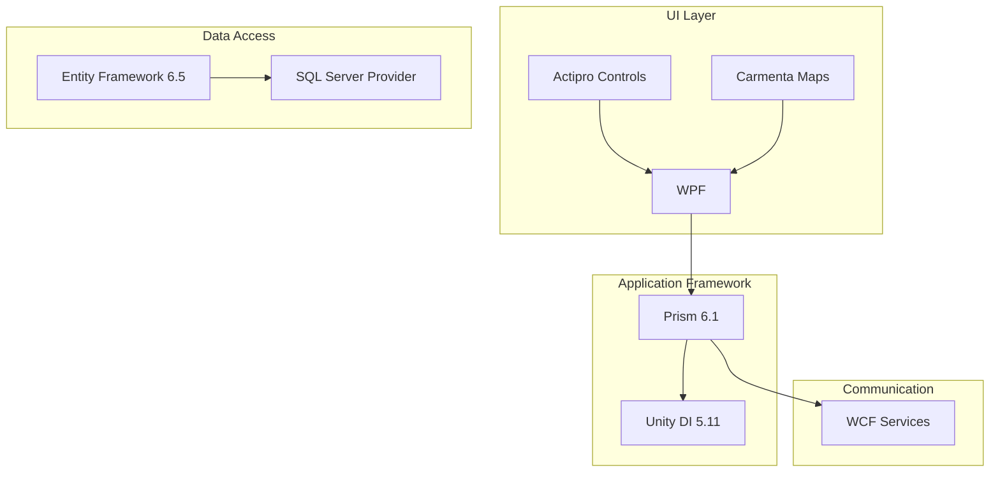
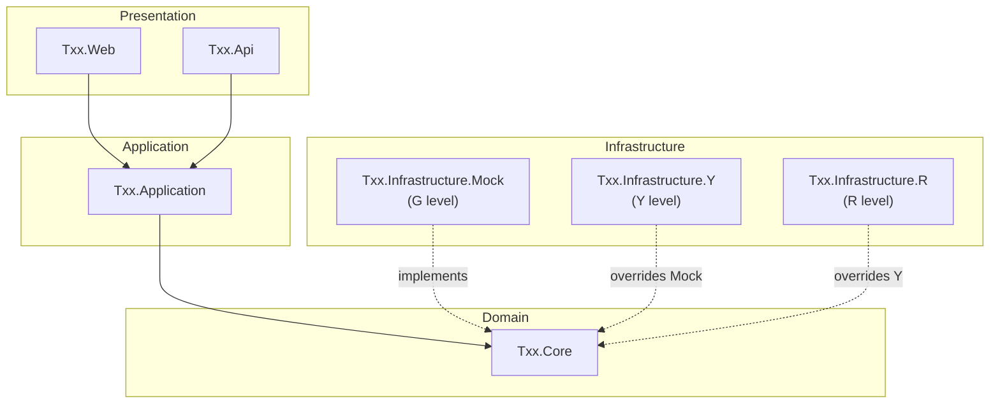

# .NET Architecture

## Overview

The TXX system is built on .NET. The solution structure, layering, and dependency injection strategy are designed to support the G → Y → R composition model. G defines the full skeleton with mockup implementations. Y and R override specific parts with real implementations — without modifying G code.

## Legacy Stack (Current State)

The next-generation architecture must evolve from this existing stack:

| Component | Version | Role |
|-----------|---------|------|
| **Carmenta** | 3.17.0 | Geospatial / mapping engine |
| **Actipro** | v6.1 / v2.4.1.4 | UI control library (docking, editors, etc.) |
| **Prism** | 6.1.97 | WPF MVVM framework (navigation, modularity, regions) |
| **.NET Framework** | 9.0 | Runtime platform |
| **WPF** | (part of .NET / Prism 6.1.97) | Desktop UI framework |
| **WCF** | (part of .NET / Prism 6.1.97) | Service communication layer |
| **Entity Framework** | 6.5.1 | ORM / data access |
| **EF SQL Server** | 6.5.1 | SQL Server provider for EF |
| **Unity** | 5.11.11 | Dependency injection container (Prism default) |

### Legacy Dependencies Map



### Migration Considerations

Each legacy component maps to a modern .NET equivalent. The G → Y → R model provides a natural migration path: build the new architecture in G with modern tech, then integrate legacy-dependent features progressively in Y and R.

| Legacy | Modern Equivalent | Migration Notes |
|--------|-------------------|-----------------|
| .NET Framework | .NET 8+ (LTS) | Core runtime migration. Enables cross-platform, better performance |
| WPF + Prism | Blazor / MAUI / WPF on .NET 8+ | UI framework decision — see below |
| WCF | gRPC / REST APIs (ASP.NET Core) | WCF has no direct .NET 8+ equivalent; CoreWCF exists for compat |
| Entity Framework 6 | Entity Framework Core 8+ | Different API surface; migration requires model/context rewrite |
| Unity DI | Microsoft.Extensions.DependencyInjection | Built-in DI in modern .NET; Prism on .NET 8 supports this |
| Actipro | Actipro for WPF (.NET 8+) / alternative | Actipro has .NET 8 builds; evaluate if still needed |
| Carmenta | Carmenta (.NET 8+ version) / alternative | Check vendor support for modern .NET |

### UI Framework Decision (Open)

The biggest architectural decision for the next-gen system:

| Option | Pros | Cons | G/Y/R Fit |
|--------|------|------|-----------|
| **WPF on .NET 8+** | Familiar to team, Carmenta/Actipro likely support it, least migration risk | Windows-only, aging framework | Good — Prism patterns carry over |
| **Blazor (Server/WASM)** | Modern web stack, cross-platform UI, rich ecosystem | New tech for team, Carmenta integration unclear | Good — but mapping library needs evaluation |
| **MAUI + Blazor Hybrid** | Desktop + web in one, modern .NET | Still maturing, smaller ecosystem | Possible — but adds complexity |

> **Recommendation:** This decision should be made early and documented. The G-level architectural frame should be built on the chosen UI framework from day one.

## Solution Structure

```
TXX/
├── src/
│   ├── Txx.Core/                    # Domain models, interfaces, shared logic
│   ├── Txx.Application/             # Use cases, application services, CQRS handlers
│   ├── Txx.Infrastructure/          # Base infrastructure (logging, caching, common utilities)
│   ├── Txx.Infrastructure.Mock/     # G-level: mock service implementations
│   ├── Txx.Api/                     # ASP.NET API host (controllers, middleware)
│   ├── Txx.Web/                     # Frontend host (Blazor / served SPA)
│   │
│   ├── Txx.Features.Y/             # Y-level: real feature implementations
│   ├── Txx.Infrastructure.Y/       # Y-level: real service implementations
│   │
│   ├── Txx.Features.R/             # R-level: classified feature implementations
│   └── Txx.Infrastructure.R/       # R-level: classified service implementations
│
├── tests/
│   ├── Txx.Core.Tests/
│   ├── Txx.Application.Tests/
│   ├── Txx.Api.Tests/
│   ├── Txx.Integration.Tests/      # Integration tests (level-specific data sources)
│   ├── Txx.Features.Y.Tests/
│   └── Txx.Features.R.Tests/
│
├── Txx.sln                          # Full solution (used in R)
├── Txx.G.slnf                       # Solution filter: G-level projects only
└── Txx.Y.slnf                       # Solution filter: G + Y projects only
```

### Key Principles

- **`Txx.Core`** and **`Txx.Application`** are level-neutral. They define interfaces and domain logic that all levels share
- **`Txx.Infrastructure.Mock`** is the G-level implementation. It provides fake data, stub services, and mock integrations
- **`Txx.Features.Y`** / **`Txx.Infrastructure.Y`** are Y-level overrides
- **`Txx.Features.R`** / **`Txx.Infrastructure.R`** are R-level overrides
- **Solution filters** (`.slnf`) control which projects are visible at each level

### What Lives Where

| Project | Present in G | Present in Y | Present in R |
|---------|:---:|:---:|:---:|
| Txx.Core | Yes | Yes | Yes |
| Txx.Application | Yes | Yes | Yes |
| Txx.Infrastructure | Yes | Yes | Yes |
| Txx.Infrastructure.Mock | Yes | Yes (fallback) | Yes (fallback) |
| Txx.Api | Yes | Yes | Yes |
| Txx.Web | Yes | Yes | Yes |
| Txx.Features.Y | — | Yes | Yes |
| Txx.Infrastructure.Y | — | Yes | Yes |
| Txx.Features.R | — | — | Yes |
| Txx.Infrastructure.R | — | — | Yes |

## Layered Architecture



### Layer Responsibilities

| Layer | Responsibility | Level-specific? |
|-------|---------------|:---:|
| **Txx.Core** | Domain entities, value objects, interfaces (`IDataService`, `IFeatureModule`, etc.) | No — shared |
| **Txx.Application** | Use cases, handlers, orchestration logic, DTOs | No — shared |
| **Txx.Api** | HTTP endpoints, middleware, authentication, request validation | Mostly shared — some routes may be level-specific |
| **Txx.Web** | UI components, pages, client-side logic | Mostly shared — some pages may be level-specific |
| **Txx.Infrastructure.*** | Concrete implementations of Core interfaces | Yes — each level has its own |

## Dependency Injection Strategy

The DI container is the mechanism that makes level composition work. Each level registers its own implementations of shared interfaces.

### Registration Pattern

```csharp
// In Txx.Infrastructure.Mock (G level)
public static class MockServiceRegistration
{
    public static IServiceCollection AddMockServices(this IServiceCollection services)
    {
        services.AddScoped<IDataService, MockDataService>();
        services.AddScoped<IFeatureRegistry, MockFeatureRegistry>();
        services.AddScoped<INotificationService, MockNotificationService>();
        return services;
    }
}

// In Txx.Infrastructure.Y (Y level — overrides G)
public static class YServiceRegistration
{
    public static IServiceCollection AddYServices(this IServiceCollection services)
    {
        services.Replace(ServiceDescriptor.Scoped<IDataService, YDataService>());
        services.Replace(ServiceDescriptor.Scoped<IFeatureRegistry, YFeatureRegistry>());
        // INotificationService stays as mock if Y doesn't override it
        return services;
    }
}

// In Txx.Infrastructure.R (R level — overrides Y)
public static class RServiceRegistration
{
    public static IServiceCollection AddRServices(this IServiceCollection services)
    {
        services.Replace(ServiceDescriptor.Scoped<IDataService, RDataService>());
        services.Replace(ServiceDescriptor.Scoped<INotificationService, RNotificationService>());
        // IFeatureRegistry stays as Y's version
        return services;
    }
}
```

### Program.cs Composition

```csharp
var builder = WebApplication.CreateBuilder(args);

// Always register G (base/mock) services
builder.Services.AddMockServices();

// Conditionally register Y overrides
#if LEVEL_Y || LEVEL_R
builder.Services.AddYServices();
#endif

// Conditionally register R overrides
#if LEVEL_R
builder.Services.AddRServices();
#endif
```

> **Alternative:** Instead of preprocessor directives, use a build-time configuration or environment variable to control which registration assemblies are loaded. See [layer-composition.md](layer-composition.md) for the full composition strategy.

## Configuration Layering

```
appsettings.json              ← Base config (G level defaults)
appsettings.G.json            ← G-specific (mockup endpoints, fake connection strings)
appsettings.Y.json            ← Y-specific (real Y endpoints, Y connection strings)
appsettings.R.json            ← R-specific (classified endpoints, R connection strings)
```

ASP.NET's built-in configuration layering handles the override chain automatically:

```csharp
builder.Configuration
    .AddJsonFile("appsettings.json")
    .AddJsonFile($"appsettings.{level}.json", optional: true)
    .AddEnvironmentVariables();
```

### Config Categories

| Category | G | Y | R |
|----------|---|---|---|
| Database connection strings | In-memory / SQLite mockup | Y-level database server | R-level classified database |
| API endpoints | Mock API base URLs | Y-approved service URLs | Internal R-network URLs |
| Auth provider | Mock identity provider | Y SSO provider | R identity infrastructure |
| Feature flags | All mockup features enabled | Y features enabled, mock features disabled | All features enabled |
| Logging | Console + file | Y-approved log aggregator | R-internal log infrastructure |

## NuGet / Package Management

### Per-Level Strategy

| Level | Strategy |
|-------|----------|
| **G** | Standard NuGet restore from nuget.org. Any package allowed. `packages.lock.json` committed for reproducibility |
| **Y** | NuGet restore from internal feed (mirrors approved packages). New packages require approval. Feed synced from curated list |
| **R** | **No network restore.** All packages pre-cached in a local NuGet folder source. Transferred via air-gap as part of the Y → R bundle |

### R-Level Package Cache

```
transfer-bundle/
├── src/              ← Y code
├── nuget-cache/      ← All .nupkg files needed for offline restore
└── nuget.config      ← Points to local folder source
```

```xml
<!-- nuget.config for R level -->
<configuration>
  <packageSources>
    <clear />
    <add key="local" value="./nuget-cache" />
  </packageSources>
</configuration>
```

This ensures `dotnet restore` works in R without any network access.

## Testing Strategy

| Test Type | G | Y | R |
|-----------|---|---|---|
| Unit tests (Core, Application) | Run against mock data | Same tests, same mock data | Same tests, same mock data |
| Infrastructure tests | Test mock implementations | Test Y implementations | Test R implementations |
| Integration tests | Full pipeline with mocks | Full pipeline with Y data sources | Full pipeline with all data sources |
| UI tests | Against mockup screens | Against Y-specific screens | Against full application |

Each level runs **all tests from lower levels** plus its own level-specific tests. If a G-level test breaks in Y or R, it indicates an override has violated the expected contract.
