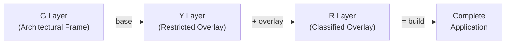
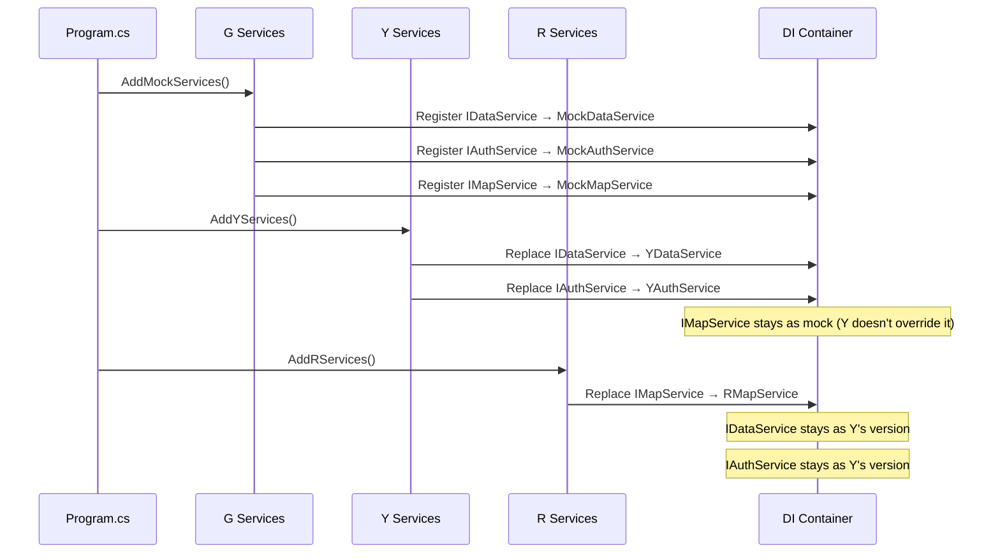

# Layer Composition: How G + Y + R Become One Application

## Overview

No single restriction level contains the full TXX application. The complete system is assembled by composing three layers:



Each layer adds or replaces specific parts. The composition is deterministic: the same G + Y + R inputs always produce the same application.

## Composition Model

The three layers compose through four mechanisms:

| Mechanism | What It Does | Example |
|-----------|-------------|---------|
| **DI Registration Override** | Y/R replace service implementations by re-registering interfaces | `IDataService`: Mock → Y real → R classified |
| **Configuration Layering** | Each level adds/overrides config values | Connection strings, endpoints, feature flags |
| **Feature Module Registration** | Y/R register real feature modules that replace mock ones | Navigation items, routes, feature pages |
| **Build-time Project Inclusion** | Solution filters or build targets control which projects are compiled | R build includes all projects; G build excludes Y/R projects |

## DI Registration Override (Primary Mechanism)

This is the core composition strategy. G defines interfaces in `Txx.Core` and registers mock implementations. Y and R override specific registrations.

### Override Chain



### Rules

1. **G always registers everything first** — the full set of interfaces gets mock implementations
2. **Y only overrides what it needs** — anything Y doesn't touch stays as G's mock
3. **R only overrides what it needs** — anything R doesn't touch stays as Y's version (or G's mock)
4. **No level removes a registration** — only replaces. The interface set defined in G is the contract

### Level Selection at Build/Runtime

Two strategies (choose one during implementation):

**Option A: Build-time preprocessor directives**
```xml
<!-- Directory.Build.props -->
<PropertyGroup>
  <TxxLevel>G</TxxLevel> <!-- Set to G, Y, or R -->
</PropertyGroup>

<PropertyGroup Condition="'$(TxxLevel)' == 'Y' Or '$(TxxLevel)' == 'R'">
  <DefineConstants>$(DefineConstants);LEVEL_Y</DefineConstants>
</PropertyGroup>

<PropertyGroup Condition="'$(TxxLevel)' == 'R'">
  <DefineConstants>$(DefineConstants);LEVEL_R</DefineConstants>
</PropertyGroup>
```

**Option B: Runtime assembly loading (plugin model)**
```csharp
// Scan for level-specific assemblies at startup
var level = builder.Configuration["TxxLevel"]; // "G", "Y", or "R"

builder.Services.AddMockServices(); // Always load G base

if (level is "Y" or "R")
{
    var yAssembly = Assembly.Load("Txx.Infrastructure.Y");
    // Invoke registration via reflection or a known interface
}
if (level is "R")
{
    var rAssembly = Assembly.Load("Txx.Infrastructure.R");
}
```

> **Recommendation:** Option A (build-time) is simpler and ensures Y/R code is never shipped in a G artifact. Option B allows a single binary with runtime toggling, which may be useful for testing but introduces risk of leaking level-specific code.

## Configuration Layering

ASP.NET Core's built-in configuration system naturally supports the G → Y → R override chain.

### File Structure

```
config/
├── appsettings.json          ← Shared defaults (logging, general settings)
├── appsettings.G.json        ← G: mock endpoints, in-memory DB, fake auth
├── appsettings.Y.json        ← Y: real Y endpoints, Y database, Y auth
└── appsettings.R.json        ← R: classified endpoints, R database, R auth
```

### Loading Order

```csharp
var level = Environment.GetEnvironmentVariable("TXX_LEVEL") ?? "G";

builder.Configuration
    .AddJsonFile("appsettings.json", optional: false)
    .AddJsonFile($"appsettings.{level}.json", optional: false)
    .AddEnvironmentVariables(prefix: "TXX_");
```

Later files override earlier ones. `appsettings.R.json` overrides anything from `appsettings.Y.json` or `appsettings.json`.

### What Gets Configured Per Level

| Config Key | G Value | Y Value | R Value |
|------------|---------|---------|---------|
| `Database:ConnectionString` | `Data Source=:memory:` | Y SQL Server | R classified SQL Server |
| `Auth:Provider` | `MockIdentity` | Y SSO endpoint | R identity service |
| `MapService:BaseUrl` | `http://localhost:5050/mock` | Y map service URL | R internal map service |
| `Features:EnableMockData` | `true` | `false` | `false` |
| `Logging:Sink` | `Console` | Y log aggregator | R internal logging |

## Feature Module Registration

Features are registered as modules. G registers mockup feature modules; Y/R register real ones.

### Feature Module Interface

```csharp
public interface IFeatureModule
{
    string Id { get; }
    string DisplayName { get; }
    void RegisterServices(IServiceCollection services);
    void RegisterRoutes(IEndpointRouteBuilder routes);
    void RegisterNavigation(INavigationBuilder nav);
}
```

### Registration Pattern

```csharp
// G level: mock features
builder.Services.AddFeatureModule<MockDashboardFeature>();
builder.Services.AddFeatureModule<MockReportingFeature>();
builder.Services.AddFeatureModule<MockMapFeature>();

// Y level: replace with real features
#if LEVEL_Y || LEVEL_R
builder.Services.ReplaceFeatureModule<MockDashboardFeature, YDashboardFeature>();
builder.Services.ReplaceFeatureModule<MockReportingFeature, YReportingFeature>();
#endif

// R level: add classified features
#if LEVEL_R
builder.Services.ReplaceFeatureModule<MockMapFeature, RMapFeature>();
builder.Services.AddFeatureModule<RClassifiedFeature>(); // New feature, no G mock
#endif
```

## Build Output

### G Build

```
publish/
├── Txx.Api.dll
├── Txx.Core.dll
├── Txx.Application.dll
├── Txx.Infrastructure.dll
├── Txx.Infrastructure.Mock.dll
├── Txx.Web.dll
└── appsettings.G.json
```

Only mock implementations. Safe to exist on public-ish GitHub.

### Y Build

```
publish/
├── (all G dlls)
├── Txx.Features.Y.dll
├── Txx.Infrastructure.Y.dll
├── appsettings.Y.json
└── ...
```

G dlls + Y overrides. Contains Y-restricted logic and data access.

### R Build

```
publish/
├── (all G + Y dlls)
├── Txx.Features.R.dll
├── Txx.Infrastructure.R.dll
├── appsettings.R.json
└── ...
```

Everything. This is the complete application. Only exists within the R environment.

## Composition Validation

To ensure the composition works correctly at every level:

| Check | When | How |
|-------|------|-----|
| All Core interfaces have registered implementations | Build time / startup | DI validation on app start (`ValidateScopes`, `ValidateOnBuild`) |
| G tests pass at Y level | Y CI pipeline | Run G test suite after Y overlay is applied |
| G + Y tests pass at R level | R CI pipeline | Run G + Y test suites after R overlay is applied |
| No level-specific code leaks down | Code review + CI scan | Automated grep for Y/R namespaces in G codebase |
| Config keys all resolved | Startup | Fail fast if required config values are missing |
