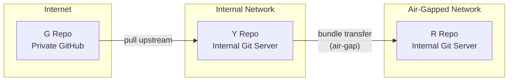
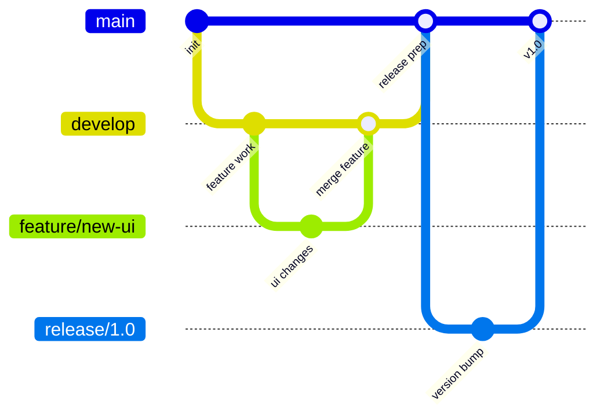
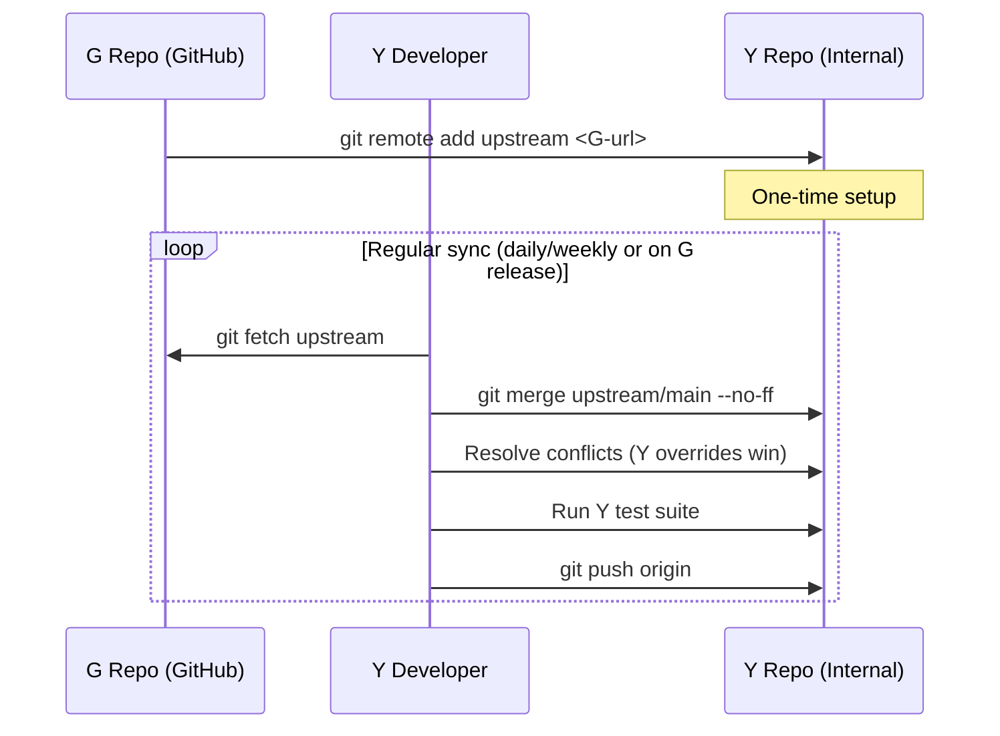
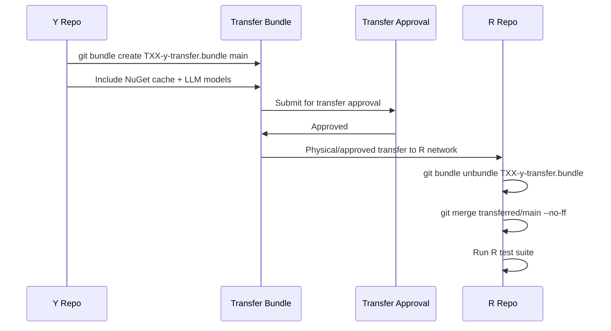

# Repository Strategy

## Overview

The TXX system uses three separate git repositories — one per restriction level. Code flows in one direction: G → Y → R. Each repo lives on a different hosting platform matching its restriction level.



## Repository Layout

### G Repo — Private GitHub

| Attribute | Value |
|-----------|-------|
| **Host** | GitHub (private repository) |
| **Access** | G-cleared developers + CI service accounts |
| **Contains** | Full architectural frame: Core, Application, Infrastructure.Mock, Api, Web |
| **Does NOT contain** | Y/R feature projects, real data configs, classified logic |
| **URL pattern** | `github.com/<org>/TXX` |

### Y Repo — Internal Git Server

| Attribute | Value |
|-----------|-------|
| **Host** | Internal git server (GitLab, Gitea, Azure DevOps, etc.) |
| **Access** | Y-cleared developers + CI service accounts |
| **Contains** | Everything from G **plus** Y-level feature projects, Y configs, Y infrastructure |
| **Does NOT contain** | R-level feature projects, classified data configs |
| **Upstream** | G repo configured as a remote |

### R Repo — Internal Git Server (Air-Gapped)

| Attribute | Value |
|-----------|-------|
| **Host** | Internal git server within air-gapped network |
| **Access** | R-cleared developers + CI service accounts |
| **Contains** | Everything from G + Y **plus** R-level feature projects, R configs, R infrastructure |
| **Upstream** | Y repo (code arrives via bundle transfer, not live remote) |

## Branching Model

All three repos follow the same branching convention for consistency. When G branches, Y and R mirror the structure.



### Branch Types

| Branch | Purpose | Exists in |
|--------|---------|-----------|
| `main` | Stable, release-ready code | G, Y, R |
| `develop` | Integration branch for ongoing work | G, Y, R |
| `feature/*` | Individual feature development | G, Y, R (level-specific features only in their level) |
| `release/*` | Release stabilization | G, Y, R |
| `hotfix/*` | Critical production fixes | G, Y, R |

### Level-Specific Branches

- **G** has features for the architectural frame and mock implementations
- **Y** has G branches + Y-specific feature branches (e.g., `feature/y-real-dashboard`)
- **R** has Y branches + R-specific feature branches (e.g., `feature/r-classified-module`)

Y/R-specific branches never appear in lower-level repos.

## Sync Strategy

### G → Y Sync



**Key rules:**
- Y developers can pull from G at any time (G is on the internet, Y has internet)
- Merge conflicts are resolved in Y, with Y-specific code taking priority
- After merge, full Y test suite must pass before pushing

### Y → R Sync (Air-Gap Transfer)



**Key rules:**
- Y code is packaged as a git bundle (or equivalent approved format)
- The bundle includes all dependencies needed for offline build (NuGet packages, etc.)
- Every transfer goes through a formal approval process
- R developers unpack and merge, resolving conflicts with R-specific code taking priority
- Full R test suite must pass after merge

### Transfer Bundle Contents

```
TXX-y-transfer-v1.2.3/
├── TXX-y-transfer.bundle        ← Git bundle (full Y history or incremental)
├── nuget-cache/                 ← All .nupkg files for offline restore
├── models/                      ← LLM models for AI workflow (if updated)
├── tools/                       ← Developer tools (if updated)
├── MANIFEST.md                  ← Version info, changelog, transfer metadata
└── CHECKSUMS.sha256             ← Integrity verification
```

## Access Control

| Role | G Repo | Y Repo | R Repo |
|------|--------|--------|--------|
| G Developer | Read/Write | — | — |
| Y Developer | Read only | Read/Write | — |
| R Developer | Read only | Read only | Read/Write |
| G CI | Read/Write | — | — |
| Y CI | Read (G) | Read/Write | — |
| R CI | — | — | Read/Write |
| Architect | Read/Write | Read/Write | Read/Write |

### Principle

- **No upward write access.** Y developers cannot push to G. R developers cannot push to Y or G
- **Read access to lower levels is allowed.** Y developers can read G (for context). R developers can read Y and G (within their network constraints)
- **Architects span all levels** for oversight and consistency

## Code Review Rules

| Level | Reviewers Required | Special Rules |
|-------|-------------------|---------------|
| **G** | 1 peer review | Standard review. Focus on architecture quality, API contracts, mock fidelity |
| **Y** | 1 peer + 1 Y-security reviewer | Check for accidental inclusion of R data patterns. Validate dependency approvals |
| **R** | 1 peer + 1 R-security reviewer | Check for data leakage risk. Validate all dependencies are pre-approved and cached |

### Automated Review Checks (CI)

All levels run these checks before merge:

- Lint and formatting
- Full test suite for the level
- Dependency audit (no unapproved packages)
- Namespace scan (Y/R namespaces must not appear in G)
- Secrets scan (no hardcoded credentials)
