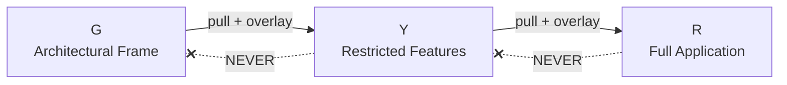
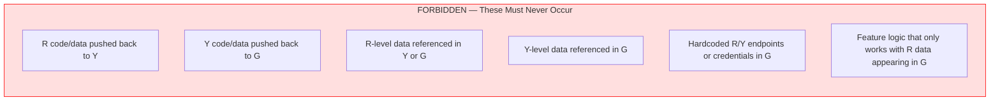

# Restriction Levels: G / Y / R

## Overview

The TXX system operates across three restriction levels. Each level adds progressively more restricted features and data. Code flows in one direction only: **G → Y → R**.

## Comparison Table

| Dimension | G | Y | R |
|-----------|-----------|------------|---------|
| **Internet** | Full access | Full access | No access |
| **External services** | Any | Limited — approved list only | None |
| **Software installs** | Anything | Approval process required | Painful approval process |
| **Git hosting** | Private GitHub repo | Internal git server | Internal git server (air-gapped) |
| **Data** | Mockup data only | Y-restricted real data | All restricted data |
| **Features** | Mockup features | Specific operational features | All features |
| **Application derivable?** | No — cannot derive the real app from G | Partially — missing R-level pieces | Yes — this is the full application |

## G Level — Architectural Frame

### What G Is

G is the **architectural skeleton** of the TXX system. It contains the full application structure, UI components, API layer, domain models, and infrastructure — all wired together and fully functional. But it runs on **mockup data** and **mockup features**.

The purpose of G is to establish all architectural patterns, conventions, and technology choices in an unrestricted environment where developers have full access to the internet, any external service, and any tooling.

### What G Contains

- Complete .NET solution structure
- All UI components with representative mockup screens
- API endpoints returning mockup data
- Domain models with placeholder business logic
- Infrastructure layer with mock service implementations
- Full test suite running against mockup data
- CI/CD pipeline definitions
- Developer documentation

### Mockup Rules

The mockups in G are not throwaway prototypes. They must follow the same architectural principles as the real application:

- **Same API contracts** — Mockup endpoints use the same request/response schemas that Y/R will use with real data
- **Same data models** — Mockup data conforms to the same domain models, just with fake values
- **Same UI components** — The component library is shared; only the data feeding into it changes
- **Same authentication/authorization patterns** — Mock identity provider with the same flow
- **Same error handling** — Mockup services simulate the same error scenarios

### What Cannot Be Inferred from G

- The nature of the real data
- Specific operational features and their business logic
- The actual number and types of real data sources
- Security classifications and access patterns
- Operational deployment topology

## Y Level — Restricted Features

### What Y Is

Y pulls the G codebase and applies **real features and Y-restricted data** on top of it. Y replaces mockup implementations with actual operational components, connects to real (but Y-level) data sources, and implements specific business logic.

### What Y Adds on Top of G

- Real feature module implementations (replacing G mockups)
- Connections to Y-restricted data sources
- Y-level business logic and validation rules
- Y-specific configuration (endpoints, credentials, connection strings)
- Additional tests covering real feature behavior
- Y-specific deployment configuration

### Environment Constraints

- **Internet:** Available — can reach external services on the approved list
- **External services:** Only pre-approved services. New services require a formal approval process
- **Software installs:** Nothing installed without going through the approval process. Developers work with the approved toolset
- **Git:** Internal git server. G code is pulled in as an upstream dependency

### Approval Process for Dependencies

Any new NuGet package, external service integration, or tooling change in Y requires:

1. Submission of a dependency request
2. Security review of the package/service
3. Compatibility check with R environment constraints
4. Formal approval before integration

> **Key consideration:** Anything added in Y must also be viable in R (no internet dependency). If a Y dependency requires network access, it must have an offline-capable alternative for R.

## R Level — Full Application

### What R Is

R pulls the Y codebase and applies **all remaining highly restricted features and data**. The R build is the **complete, fully functional TXX application**. Only at R level does the system contain all features, all data sources, and all operational capabilities.

### What R Adds on Top of Y

- Highly restricted feature implementations
- Connections to all classified data sources
- Full operational business logic
- R-specific security configurations
- R-specific deployment and infrastructure config
- Final integration tests covering the complete feature set

### Environment Constraints

- **Internet:** None. Zero external network access
- **External services:** None. Everything runs locally or on internal infrastructure
- **Software installs:** Painful approval process. Every tool, library, and runtime must be pre-approved and transferred in
- **Git:** Internal git server within the air-gapped network. Code arrives via approved transfer mechanism from Y

### Developer Experience Challenges

Working in R is the most constrained developer experience:

| Challenge | Impact | Mitigation |
|-----------|--------|------------|
| No internet | Cannot search docs, download packages, use cloud tools | Pre-cached packages, local documentation mirrors, local LLM (see AI Workflow docs) |
| No external services | Cannot use SaaS tools, cloud CI, hosted databases | All services run on internal infrastructure |
| Painful install process | New tools take days/weeks to approve | Standardized developer toolkit transferred as a bundle |
| Air-gapped git | No real-time sync with Y | Scheduled bundle transfers with clear versioning |

## Boundary Rules

### What Must NEVER Happen

### Enforcement

- **Code reviews** at each level check for accidental data/feature leakage
- **Automated scanning** in CI pipelines to detect restricted patterns in lower levels
- **Clear separation** in the .NET solution between shared code and level-specific code
- **Interface-driven design** ensures G defines contracts, Y/R provide implementations — not the other way around
