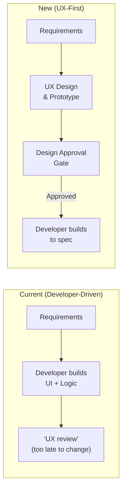

# UX-First Process

## Purpose

Today, developers make UI/UX decisions during implementation. This document set defines the shift to a **UX-first process** where design happens **before** development begins. Developers implement what designers have designed and approved — not the other way around.

## The Problem

When developers drive UI/UX decisions:

- Interfaces are shaped by implementation convenience, not user needs
- Inconsistent patterns across features (each developer's interpretation differs)
- UX debt accumulates — it becomes the "thing we'll fix later" that never gets fixed
- Users adapt to the system instead of the system adapting to users

## The Shift

## Documents

Read in this order:

| # | Document | Description |
|---|----------|-------------|
| 1 | [design-workflow.md](design-workflow.md) | The full UX-first lifecycle, approval gates, and tooling |
| 2 | [design-to-dev-handoff.md](design-to-dev-handoff.md) | How approved designs feed into G / Y / R development |
