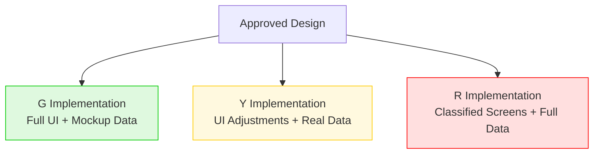
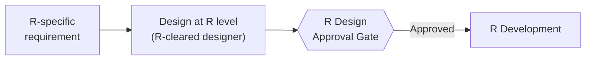
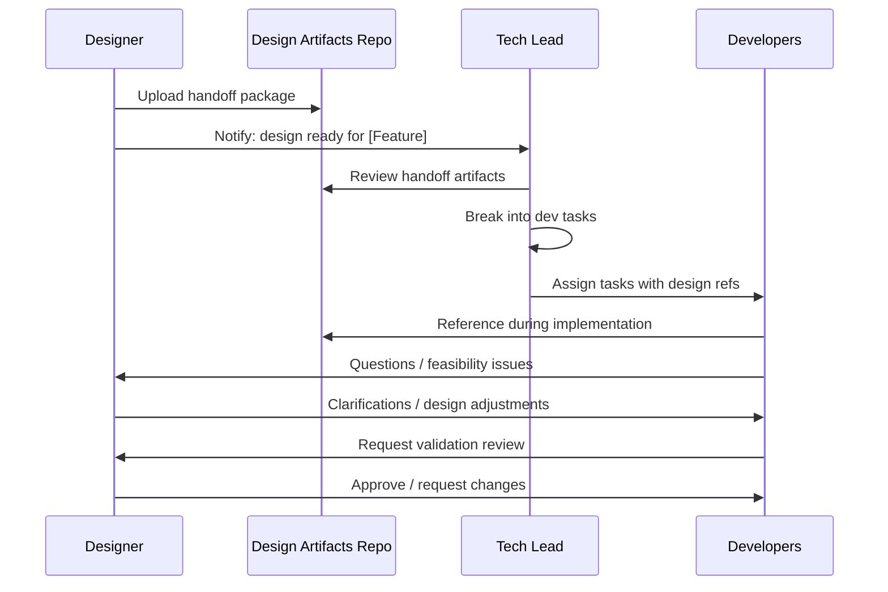

# Design-to-Dev Handoff

## Overview

Once a design passes the approval gate, it's handed off to development. This document defines what designers deliver, how designs map to the G/Y/R levels, and how the feedback loop works.

## Handoff Artifacts

The designer delivers a complete specification package for each approved feature:

### 1. Annotated Screen Specs

Visual specifications for every screen and state:

| Artifact | Description |
|----------|-------------|
| Screen layouts | Pixel-accurate mockups for each screen |
| State variations | Empty state, loading, error, success, populated (few items, many items) |
| Annotations | Spacing values, font sizes, colors (referencing design system tokens) |
| Responsive rules | Behavior at different viewport sizes / window sizes |

### 2. Component Breakdown

Which design system components are used, and any new components introduced:

```
Feature: [Feature Name]

Existing components used:
  - TxxDataTable (with sorting, filtering)
  - TxxButton (Primary, Secondary)
  - TxxModal (Confirmation variant)
  - TxxMapView (with overlay layer)

New components needed:
  - TxxTimelineView — new component, spec attached
  - TxxStatusBadge — new variant of existing TxxBadge
```

### 3. Interaction Specifications

Detailed behavior for interactive elements:

| Element | Trigger | Behavior |
|---------|---------|----------|
| Row click in data table | Single click | Select row, show detail panel |
| Row click in data table | Double click | Open full detail view |
| Filter dropdown | Change selection | Table updates immediately (no submit button) |
| Map marker click | Single click | Show info popup |
| Delete button | Click | Confirmation modal → on confirm: delete + show toast |

### 4. Data Requirements

What data the UI expects, mapped to API contracts:

| UI Element | Data Source | Fields Needed | Notes |
|------------|------------|---------------|-------|
| Main table | `GET /api/items` | id, name, status, updatedAt | Sortable by all columns |
| Detail panel | `GET /api/items/{id}` | All item fields | Loaded on row select |
| Map layer | `GET /api/items/geo` | id, lat, lon, status | Clustered at zoom < 10 |

This ensures the mockup API contracts in G match what the UI actually needs.

## Mapping Designs to G / Y / R

The same design maps to different implementation scopes at each level:



### G Level — Full UI with Mockup Data

**What developers build at G:**
- Every screen from the design, fully implemented
- All interactions working
- All states (empty, loading, error, populated) functional
- Connected to mock API endpoints returning fake data
- Design system components built or extended as needed

**The G implementation should be visually indistinguishable from the final application** — only the data is fake.

### Y Level — Real Features, Real (Y-Level) Data

**What developers adjust at Y:**
- Replace mock API connections with real Y-level data sources
- Add Y-specific feature logic (business rules, validation)
- Adjust any UI elements that differ for Y-specific workflows
- Wire up Y-level authentication and authorization

**Most of the UI code from G carries over unchanged.** Y work is primarily infrastructure and backend.

### R Level — Classified Screens, Full Data

**What developers add at R:**
- Connect remaining data sources (R-classified)
- Implement R-specific screens or features not present in G/Y
- Apply R-level security configuration
- Final integration of all feature modules

**R-specific UI screens** (features that don't exist in G at all) need their own design cycle:



## Designer Access by Level

Not all designers can access all levels. Design work is restricted by the designer's clearance:

| Designer Clearance | Can Design For | Can See Mockups From | Can See Real Data From |
|-------------------|----------------|---------------------|----------------------|
| G-cleared | G features | G | — |
| Y-cleared | G + Y features | G, Y | Y |
| R-cleared | G + Y + R features | G, Y, R | Y, R |

### Implications

- **G designs** are created by any designer. They use mockup data and generic feature descriptions
- **Y designs** require Y-cleared designers who understand Y-level workflows and data
- **R designs** require R-cleared designers. R-specific features may have unique UX requirements driven by operational context that only R-cleared personnel understand

## Handoff Process



### Where Handoff Artifacts Live

| Level | Location | Format |
|-------|----------|--------|
| **G** | G repo: `docs/designs/[feature-name]/` | Exported images, spec PDFs, component list |
| **Y** | Y repo: `docs/designs/[feature-name]/` | Y-specific additions/overrides |
| **R** | R repo: `docs/designs/[feature-name]/` | R-specific screens, exported from R network |

Design artifacts travel with the code through the G → Y → R pipeline. G designs are available at all levels. Y designs are available at Y and R. R designs only exist at R.

## Feedback Loop

Development sometimes reveals that a design needs adjustment. This is expected and healthy — but it must be handled through the process, not by developers making unilateral changes.

### When Developers Find Design Issues

| Situation | Action |
|-----------|--------|
| Technical constraint makes design impossible | Developer raises issue → designer proposes alternative → quick review/approval |
| Performance concern (e.g., rendering 10,000 rows) | Developer provides data → designer adjusts (e.g., pagination/virtualization) |
| Edge case not covered in design | Developer documents case → designer provides spec → dev implements |
| Developer has a "better idea" | Raise it — but the designer decides. Dev does not override design |

### Feedback Rules

1. **Developers do not change the UI without designer involvement.** Even small changes ("I moved this button, it works better here") must be validated
2. **Designers must be responsive.** Blocking developers for days on a minor clarification is not acceptable. Set SLAs (e.g., 24h response on dev questions)
3. **Unresolved disagreements** escalate to the product owner, not decided unilaterally by either side
