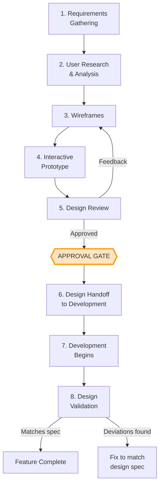

# Design Workflow: UX-First Methodology

## Overview

Every user-facing feature goes through the design process **before** any development begins. The design workflow produces approved, detailed specifications that developers implement. Development without an approved design is not permitted.

## The UX-First Lifecycle



## Phase 1: Requirements Gathering

**Who:** Product owner, UX designer, stakeholders

**Activities:**
- Define the user problem or need
- Identify target users and their context
- Document functional requirements
- Define success criteria
- Identify which restriction levels (G/Y/R) the feature spans

**Output:** Requirements brief — a short document describing what and why, not how

## Phase 2: User Research & Analysis

**Who:** UX designer (+ user researchers if available)

**Activities:**
- Analyze similar patterns in the existing system
- Review how users currently accomplish the task
- Identify pain points in current workflows
- Study reference implementations (competitor or internal)
- Consider R-level constraints (users may be in restricted environments with specific workflows)

**Output:** Research summary with key findings and design implications

## Phase 3: Wireframes

**Who:** UX designer

**Activities:**
- Create low-fidelity wireframes for all screens/states
- Map user flows (happy path + error states)
- Define responsive behavior rules
- Identify component reuse from the design system
- Annotate with interaction notes

**Output:** Wireframe set covering all user flows

## Phase 4: Interactive Prototype

**Who:** UX designer

**Activities:**
- Build clickable/interactive prototype from wireframes
- Include realistic content and data volume
- Demonstrate transitions and loading states
- Cover edge cases (empty states, error states, long text, many items)

**Output:** Interactive prototype that stakeholders can navigate

## Phase 5: Design Review

**Who:** UX designer presents to: product owner, tech lead, stakeholders, representative users (if possible)

**Review checklist:**

| Criteria | Check |
|----------|-------|
| Solves the stated user problem | Does the design address the requirements brief? |
| Consistent with design system | Does it use existing components and patterns? |
| All states covered | Happy path, empty, loading, error, edge cases? |
| Accessibility | Keyboard navigation, contrast, screen reader considerations? |
| Responsive behavior | How does it adapt to different screen sizes? |
| Feasibility | Tech lead confirms it's implementable within the architecture? |
| Level-appropriate | No R-level data visible in G wireframes? |

**Outcomes:**
- **Approved** → proceed to handoff
- **Approved with minor changes** → designer makes fixes, no re-review needed
- **Needs revision** → return to wireframe phase with specific feedback

## The Approval Gate

This is the critical process control. **No development work begins without passing this gate.**

### Who Approves

| Approver | What They Verify |
|----------|-----------------|
| UX Lead | Design quality, consistency with design system |
| Product Owner | Alignment with requirements and business goals |
| Tech Lead | Technical feasibility within the G/Y/R architecture |

### Approval Record

Each approved design gets a record:

```
Feature:        [Feature name]
Design version: [v1.0]
Approved by:    [Names + roles]
Approved date:  [Date]
Conditions:     [Any conditions or notes]
Linked req:     [Requirements brief reference]
```

### Exceptions

In rare cases, development may start before full design approval:

- **Infrastructure / non-UI work** — Backend services, data layer, CI pipelines (no UI = no design needed)
- **Critical hotfix** — Emergency fix where waiting for design would cause operational impact. Design review happens retroactively
- **Proof of concept** — Technical exploration explicitly marked as throwaway. Cannot ship to any level without design approval

All exceptions must be documented and the design process completed retroactively.

## Phase 6: Design Handoff

See [design-to-dev-handoff.md](design-to-dev-handoff.md) for the full handoff process.

## Phase 7 & 8: Development and Validation

During and after development, the UX designer validates that the implementation matches the approved design. This is not a new design phase — it's a compliance check.

| Check | Who | When |
|-------|-----|------|
| Component-level match | UX designer | During development (incremental reviews) |
| Full feature match | UX designer + product owner | Before feature is merged to main |
| Cross-level consistency | UX designer | When feature appears at Y/R level |

## Tooling

### Design Tool Requirements

The design tool must work across the TXX restriction levels:

| Requirement | Reason |
|-------------|--------|
| Offline-capable or exportable | R-level designers cannot use cloud tools |
| Component library support | Design system must be shareable |
| Prototype capability | Interactive reviews without coding |
| Version-controlled exports | Track design evolution alongside code |

### Tool Options

| Tool | G | Y | R | Notes |
|------|---|---|---|-------|
| **Figma** | Yes | Possibly (if approved) | No (cloud-only) | Best for G; exports work for R |
| **Penpot** (self-hosted) | Yes | Yes | Yes (self-hosted on R network) | Open source Figma alternative |
| **Axure** (desktop) | Yes | Yes | Yes (offline license) | Full offline support |
| **Sketch** (macOS) | Yes | Yes | Yes (offline) | macOS only |
| **Adobe XD** (desktop) | Yes | Possibly | Possibly (offline mode) | Check licensing for air-gap |

> **Recommendation:** Use a tool that works at all levels, or establish an export pipeline: design in Figma at G level → export assets and specs → transfer to Y/R as part of the design handoff artifacts.

## Design System

A shared design system ensures consistency across all features and levels.

### Design System Components

| Category | Examples |
|----------|---------|
| **Foundations** | Colors, typography, spacing, grid, icons |
| **Components** | Buttons, forms, tables, cards, modals, navigation |
| **Patterns** | Search, filtering, CRUD operations, data visualization |
| **Templates** | Page layouts, dashboard layouts, detail views |
| **Map patterns** | Map controls, overlays, legends (Carmenta-related) |

### Design System ↔ Code Mapping

Every design system component should have a corresponding .NET UI component in the G-level codebase:

```
Design System Token    →    Code Component
─────────────────────────────────────────
Button/Primary         →    <TxxButton Variant="Primary" />
Table/Default          →    <TxxDataTable />
Modal/Confirmation     →    <TxxConfirmDialog />
Map/BaseView           →    <TxxMapView />
```

This mapping is maintained as a living reference document within the design system.
