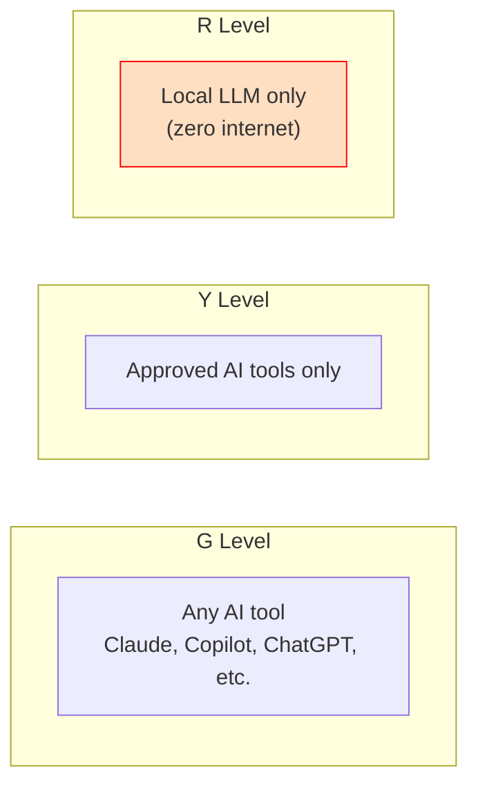

# AI Workflow

## Purpose

This document set defines how AI-assisted development works across the three TXX restriction levels (G, Y, R). The core challenge: developers at R level have **no internet** but still need AI tooling. The solution is a local LLM workflow.

## The Challenge

Developers working at all levels need AI assistance for productivity. But the tools available shrink as the restriction level increases. This document set ensures developers at every level — especially R — have a viable AI workflow.

## Documents

Read in this order:

| # | Document | Description |
|---|----------|-------------|
| 1 | [ai-strategy-by-level.md](ai-strategy-by-level.md) | AI tooling and model options across G, Y, and R |
| 2 | [r-level-local-llm.md](r-level-local-llm.md) | Detailed local LLM setup, infrastructure, and developer workflow for R |
