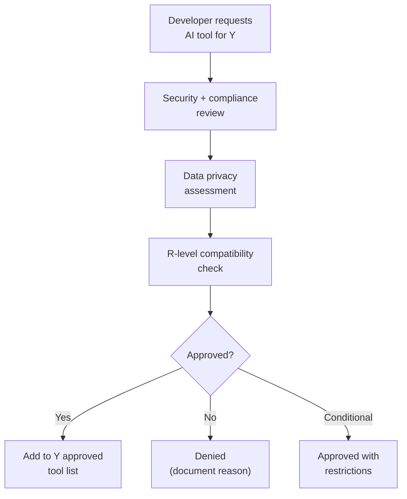

# AI Strategy by Level

## Overview

AI-assisted development is a core part of the TXX developer experience. Each restriction level has different constraints on what AI tools and models are available.

## AI Capabilities by Level

| Capability | G | Y | R |
|-----------|-----------|------------|---------|
| **Cloud LLMs** | Any (Claude, GPT, Gemini, etc.) | Approved services only | None |
| **Code completion** | GitHub Copilot, any IDE plugin | Approved plugins only | Local LLM-based |
| **Chat assistance** | Any AI chat tool | Approved tools only | Local LLM chat |
| **Code review** | AI-assisted review tools | Approved tools only | Local LLM review |
| **Documentation gen** | Any AI tool | Approved tools only | Local LLM |
| **Test generation** | Any AI tool | Approved tools only | Local LLM |
| **Web search** | Unrestricted | Unrestricted | None |
| **Stack Overflow, docs** | Unrestricted | Unrestricted | Local mirrors only |

## G Level — Unrestricted AI

G developers have full access to any AI tool. This is the environment where:

- AI-assisted architecture decisions are explored
- Code generation experiments happen freely
- New AI tools are evaluated before being proposed for Y
- Mockup features can be rapidly prototyped with AI assistance

### Recommended G-Level AI Stack

| Tool | Purpose |
|------|---------|
| **GitHub Copilot** | Real-time code completion in IDE |
| **Claude / ChatGPT** | Architecture Q&A, code review, complex problem solving |
| **Claude Code / Cursor** | AI-assisted code editing, multi-file changes |
| **AI test generators** | Generate test cases from code |
| **AI doc generators** | Generate XML doc comments, README content |

### G Level Responsibility

G developers should document which AI tools and patterns work well, to inform Y and R tool selection. What works in G helps shape what gets approved for Y and what gets replicated locally for R.

## Y Level — Approved AI Only

Y developers have internet but are restricted to approved tools. The approval process considers:

| Criterion | Why It Matters |
|-----------|---------------|
| Data privacy | Does the tool send code to external servers? What's the data retention policy? |
| Service reliability | Is the service stable enough for development dependency? |
| R compatibility | Can this tool (or a comparable alternative) work at R level? |
| Security audit | Has the tool/service passed security review? |
| License compliance | Does the tool's license allow use in this context? |

### Y-Level AI Approval Process

### Likely Y-Level Approved Tools

| Tool | Likelihood | Notes |
|------|-----------|-------|
| Self-hosted LLM (internal server) | High | Code stays internal |
| GitHub Copilot (Enterprise, with data controls) | Medium | Depends on data policy |
| Internal AI code review service | High | If available |
| Cloud LLM with zero-retention agreement | Medium | Depends on vendor and classification |

## R Level — Local LLM Only

R developers have **zero internet access**. All AI assistance must run locally within the air-gapped network.

### R-Level AI Capabilities

| Capability | Available? | How |
|-----------|-----------|-----|
| Code completion | Yes | Local LLM via IDE extension |
| Chat assistance | Yes | Local LLM chat interface |
| Code review help | Yes | Local LLM prompted with diffs |
| Documentation gen | Yes | Local LLM with codebase context |
| Test generation | Yes | Local LLM with codebase context |
| Web search | No | Use local doc mirrors instead |
| Latest model updates | No | Models updated via air-gap transfer |

See [r-level-local-llm.md](r-level-local-llm.md) for the full R-level AI setup.

## AI Use Cases Across All Levels

Regardless of the tools available, AI assists with the same development tasks:

### 1. Code Generation & Completion

- Autocomplete code as developers type
- Generate boilerplate (controllers, services, models, tests)
- Implement interfaces from method signatures
- Generate DI registrations from interface definitions

### 2. Code Review Assistance

- Review PRs for potential issues
- Check for .NET anti-patterns
- Verify adherence to TXX architectural conventions
- Flag potential security concerns

### 3. Documentation Generation

- Generate XML doc comments from method signatures
- Create README sections from code analysis
- Document API endpoints from controller definitions
- Generate design decision records

### 4. Test Generation

- Generate unit tests from implementation code
- Create integration test scaffolding
- Generate edge case test scenarios
- Mock setup generation for DI-heavy code

### 5. Codebase Q&A

- "Where is [feature X] implemented?"
- "What interface should I implement for [use case]?"
- "How does the G → Y override work for this service?"
- "What tests cover this behavior?"

## Model Selection Guide

| Level | Recommended Models | Notes |
|-------|-------------------|-------|
| **G** | Claude Opus/Sonnet, GPT-4o, latest Copilot | Use the best available. No restrictions |
| **Y** | Approved cloud models OR self-hosted (Llama 3, Mistral) | Balance capability vs data privacy requirements |
| **R** | Local: DeepSeek Coder V2, CodeLlama 34B, Qwen2.5-Coder 32B, Mistral | Must fit on available hardware. See R-level doc for hardware requirements |

## Metrics

Track AI adoption and effectiveness across levels to justify investment and identify gaps:

| Metric | How to Measure |
|--------|---------------|
| AI tool adoption rate | % of developers actively using AI tools per level |
| Perceived productivity impact | Developer survey (quarterly) |
| Code quality impact | Defect rates before/after AI tool adoption |
| R-level AI satisfaction | Are R developers getting adequate AI support? |
