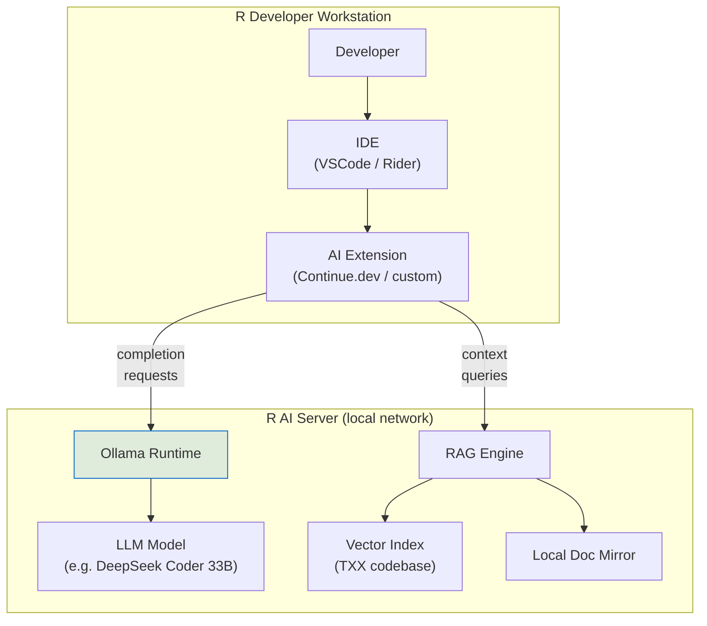
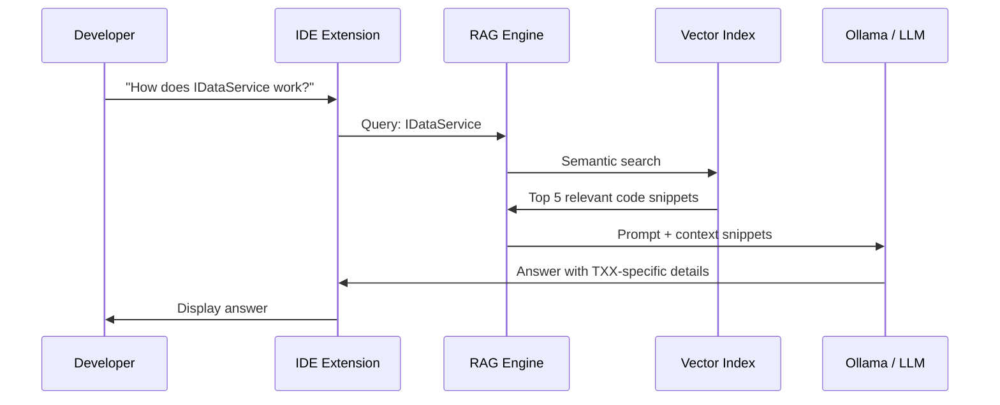
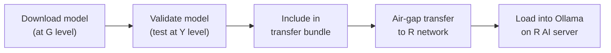

# R-Level Local LLM: Setup & Developer Workflow

## The R Constraint

R developers work in an air-gapped environment with **zero internet access**. No cloud AI, no external APIs, no online documentation. Everything must run locally. Despite these constraints, R developers need effective AI assistance — they work on the most complex part of the system.

## Architecture



### Components

| Component | Purpose | Runs On |
|-----------|---------|---------|
| **Ollama** | LLM inference runtime. Serves models via local HTTP API | R AI server (GPU) |
| **LLM Model** | The actual language model for code generation/chat | R AI server (GPU VRAM) |
| **IDE Extension** | Connects IDE to Ollama for completions and chat | Developer workstation |
| **RAG Engine** | Retrieval-augmented generation over the codebase | R AI server or workstation |
| **Vector Index** | Searchable index of the TXX codebase for context-aware answers | R AI server |
| **Local Doc Mirror** | Offline copies of .NET docs, NuGet package docs, etc. | R network file share |

## Infrastructure

### Hardware Requirements

The LLM model is the primary resource consumer. Requirements depend on model size:

| Model Size | GPU VRAM | System RAM | Storage | Throughput |
|-----------|----------|------------|---------|------------|
| 7B params (e.g. CodeLlama 7B) | 8 GB | 16 GB | 10 GB | Fast — good for completions |
| 13-14B params (e.g. CodeLlama 13B) | 16 GB | 32 GB | 20 GB | Good balance |
| 33-34B params (e.g. DeepSeek Coder 33B) | 24-48 GB | 64 GB | 40 GB | Best quality, slower |
| 70B+ params | 80+ GB (multi-GPU) | 128 GB | 80 GB | Highest quality, slowest |

### Recommended Setup

**Minimum viable (per-developer or small team):**
- 1x workstation with NVIDIA RTX 4090 (24 GB VRAM) or equivalent
- Run 13B or quantized 33B model
- Suitable for a team of 1-3 developers

**Recommended (team server):**
- 1x server with NVIDIA A100 (40/80 GB) or 2x RTX 4090
- Run 33B model at full quality or 70B quantized
- Serves 5-15 developers concurrently via Ollama API

**Optimal (if budget allows):**
- Dedicated AI server with 2x A100 80GB or H100
- Run 70B model unquantized
- Best quality outputs, serves large teams

### Model Selection

| Model | Size | Strength | Best For |
|-------|------|----------|----------|
| **DeepSeek Coder V2** | 16B / 33B | Strong code generation, good .NET support | Primary coding model |
| **Qwen2.5-Coder** | 7B / 14B / 32B | Excellent code completion, broad language support | Code completions |
| **CodeLlama** | 7B / 13B / 34B | Good code generation, well-established | General coding |
| **Mistral / Mixtral** | 7B / 8x7B | Strong general reasoning | Architecture Q&A, docs |
| **Llama 3** | 8B / 70B | Strong general purpose | Documentation, explanations |

> **Recommendation:** Run two models — a smaller one (7-14B) for fast code completions, and a larger one (33B+) for chat/reasoning tasks.

### Ollama Setup

```bash
# Install Ollama (transferred via air-gap bundle)
# Ollama binary included in the transfer bundle

# Load models (pre-downloaded, transferred via air-gap)
ollama create deepseek-coder:33b -f /models/deepseek-coder-33b.gguf
ollama create qwen2.5-coder:14b -f /models/qwen2.5-coder-14b.gguf

# Verify
ollama list
ollama run deepseek-coder:33b "Write a C# interface for a data service"
```

Ollama serves an OpenAI-compatible API at `http://localhost:11434` (or the AI server's address on the R network).

## Developer Workflow

### Code Completion

Real-time code completions as developers type, powered by the local LLM.

**IDE Setup (VSCode with Continue.dev):**

```json
// .continue/config.json
{
  "models": [
    {
      "title": "DeepSeek Coder 33B",
      "provider": "ollama",
      "model": "deepseek-coder:33b",
      "apiBase": "http://r-ai-server:11434"
    }
  ],
  "tabAutocompleteModel": {
    "title": "Qwen2.5 Coder 14B",
    "provider": "ollama",
    "model": "qwen2.5-coder:14b",
    "apiBase": "http://r-ai-server:11434"
  }
}
```

**IDE Setup (JetBrains Rider):**
- Use the Ollama plugin or Continue.dev for JetBrains
- Configure to point at the R AI server

### Chat-Based Assistance

Developers can chat with the LLM for:
- Architecture questions ("How does the DI override chain work?")
- Implementation guidance ("Generate a service that implements IDataService")
- Debugging help ("Why might this EF Core query return null?")
- Code review ("Review this method for potential issues")

The chat interface (Continue.dev sidebar or terminal) sends prompts to Ollama and returns responses.

### Terminal-Based AI

For developers who prefer the command line:

```bash
# Quick question
ollama run deepseek-coder:33b "Explain the repository pattern in .NET"

# Pipe code for review
cat MyService.cs | ollama run deepseek-coder:33b "Review this C# code for issues"

# Generate a test
ollama run deepseek-coder:33b "Generate xUnit tests for this interface: $(cat IDataService.cs)"
```

## RAG: Codebase-Aware Answers

Plain LLM responses lack context about the TXX codebase. RAG (Retrieval-Augmented Generation) fixes this by indexing the codebase and injecting relevant code snippets into prompts.

### How RAG Works



### RAG Setup

| Component | Tool Options | Notes |
|-----------|-------------|-------|
| **Embedding model** | `nomic-embed-text` via Ollama, or `all-MiniLM-L6-v2` | Small, runs locally |
| **Vector store** | ChromaDB, Qdrant (local), LanceDB | All run offline |
| **Indexing** | Index all .cs, .json, .md files in the TXX repo | Re-index on each Y → R merge |
| **Query integration** | Continue.dev `@codebase` context, or custom script | Hooks into IDE chat |

### What Gets Indexed

| Content | Why |
|---------|-----|
| All C# source files | Code context for answers |
| Interface definitions | Most valuable for "how do I implement X" questions |
| appsettings*.json | Configuration context |
| docs/ folder | Design specs, architecture notes |
| Test files | Test patterns and examples |

## Model Management

### How Models Get Into R

Models are large files (4-40+ GB). They travel via the same air-gap transfer mechanism as code:



### Model Update Process

1. New model identified and tested at G level
2. Validated at Y level (quality, performance, resource usage)
3. Added to the next Y → R transfer bundle
4. Loaded onto R AI server after transfer
5. Previous model kept as fallback until new model is validated in R

### Model Version Tracking

```
models/
├── MODELS.json            ← Model manifest (name, version, hash, date transferred)
├── deepseek-coder-33b.gguf
├── qwen2.5-coder-14b.gguf
└── nomic-embed-text.gguf
```

```json
// MODELS.json
{
  "models": [
    {
      "name": "deepseek-coder:33b",
      "file": "deepseek-coder-33b.gguf",
      "version": "2.0",
      "quantization": "Q5_K_M",
      "size_gb": 22.3,
      "transferred": "2026-01-15",
      "sha256": "abc123..."
    }
  ]
}
```

## Enhancing Quality

Local models are less capable than cloud models. These strategies close the gap:

### 1. System Prompts

Configure Ollama with a TXX-specific system prompt:

```
You are a .NET development assistant for the TXX system. The codebase follows clean architecture with:
- Txx.Core: domain models and interfaces
- Txx.Application: use cases and handlers
- Txx.Infrastructure.*: level-specific implementations (Mock, Y, R)
- DI-based service overrides between levels

When generating code, follow these conventions:
- Use IServiceCollection extension methods for DI registration
- Follow the IFeatureModule pattern for feature registration
- Use appsettings layering for configuration
- Generate xUnit tests with Moq for mocking
```

### 2. RAG with Codebase Context

As described above — always provide relevant code snippets as context.

### 3. Few-Shot Examples

Include examples of TXX code patterns in prompts:

```
Here's how we implement a service in TXX:

// Interface in Txx.Core
public interface IItemService
{
    Task<Item?> GetByIdAsync(int id);
    Task<IReadOnlyList<Item>> GetAllAsync();
}

// Mock in Txx.Infrastructure.Mock
public class MockItemService : IItemService { ... }

// Real in Txx.Infrastructure.Y
public class YItemService : IItemService { ... }

Now implement IReportService following the same pattern.
```

### 4. Local Documentation Mirror

Transfer offline copies of essential documentation:

| Documentation | Source | Transfer Method |
|---------------|--------|----------------|
| .NET API reference | Microsoft docs | HTTrack mirror or offline download |
| EF Core docs | Microsoft docs | Same |
| ASP.NET Core docs | Microsoft docs | Same |
| NuGet package docs | Package READMEs | Bundled with NuGet cache |
| TXX architecture docs | This repo | Travels with code |

## Limitations

| Limitation | Impact | Mitigation |
|-----------|--------|------------|
| Smaller models than cloud | Lower quality completions and reasoning | Use largest model hardware allows; use RAG for context |
| No real-time model updates | Model knowledge frozen at transfer date | Regular transfers with updated models |
| No web search fallback | Can't look up unknown APIs or patterns | Local doc mirrors, comprehensive RAG index |
| Higher latency (large models) | Slower responses than cloud APIs | Use small model for completions, large for chat |
| No fine-tuning infrastructure (usually) | Can't customize model on TXX data easily | Compensate with good system prompts and RAG |
